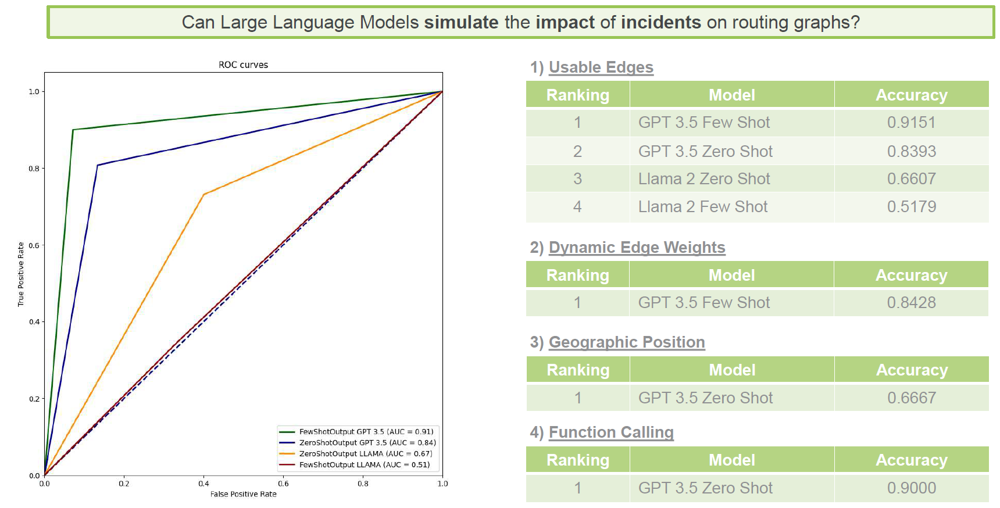
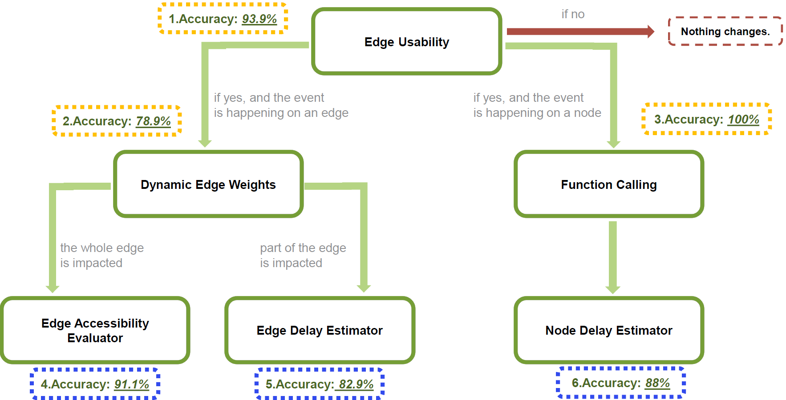

# InES Team Project SS24 - Intelligent Hospital Logistics
> A European Team Project of students from the Babeș-Bolyai University in Cluj-Napoca and the University of Mannheim in the spring semester 2024.

>**Participants**:
>* Sergiu-Dacian Balint
>* Diana Matei
>* Sara Koni
>* Arved Schreiber
>* Paul König
## Introduction
### Background
The coronavirus pandemic has shown that exceptional medical situations, coupled with staff shortages, can push entire hospital systems to their limits. The research project ”MediCar 4.0” seeks to create an advanced transport logistics platform for self-driving vehicles on clinic premises to avoid future bottlenecks and enhance operational efficiency. However, the dynamic nature of emergencies, failures, and other unpredictable events poses challenges. Many conflicts, such as congestion and deadlocks, can only be adequately resolved with expert knowledge, causing classical optimization algorithms to fall short.
### Project Goal
This team project aims to develop robust AI-based routing strategies that integrate world-knowledge from large language models to meet the challenges of clinical processes and various supplies. In this context, we build a simulation environment of the University Hospital in Freiburg and implement routing algorithms to test them in various scenarios.
## Quickstart
* Install the required packages: `pip install -r requirements.txt`
* Create .env file in the root directory according to the .env.example file
* Start the main.py scripts in the following order: First Simulation, second Vehicle and third OrderManager
* To generate prompts by the vehicles, activate the button under the tab "Prompts"

If you want to create prompts by yourself, you can find examples of possible prompts under `Resources/edge_incidents.csv` for individual models and `Resources/metadataset.csv` for our metamodel.
## Repository Structure
The project is structured in a modular way. Each module is responsible for a specific task. The main modules are: 
* `Simulation`
* `Vehicle`
* `OrderManager`

Communication between these modules is done solely via MQTT, otherwise they are completely decoupled.

The folder `Artifacts` contains pdf-files with presentation slides and information about the LLM evaluation.
`Resources` includes csv-files with the LLM outputs for evaluation purposes as well as a heuristic file of orders and the osm-file of the University Hospital of Freiburg. The folder `docs` exists to include pictures in the README.
### Module `Simulation`
The module `Simulation` connects the two other main modules `OrderManager` and `Vehicle`.
The `OrderManager` sends an MQTT-message to the `Simulation` under the topic “/order”. The module `Simulation` creates the route for the order and sends it via MQQT to `Vehicle` under the topic “/vehicles” such that the order can be fulfilled and gets responses regarding the current state. Furthermore, `Simulation` includes all the LLM models to handle the impact of events to the graph and the routing of the vehicles.
| File                      | Role                                                                                                                 |
|---------------------------|----------------------------------------------------------------------------------------------------------------------|
| `main.py`                 | Main script to build the graph and activate the routing                                                              |
| `BuildGraph.py`           | Source code of graph creation                                                                                        |
| `Routing.py`              | Source code of the class Routing                                                                                     |
| `LLM_Dynamic_Weights.py`  | Determines if an incident impacts the whole length of the edge or only a part of it                                  |
| `LLM_Edge_Usability.py`   | Determines if an incident impacts the usability of the edge or not                                                   |
| `LLM_Evaluation.py`       |    Evaluates the performance of our Edge Accessibility Evaluator, Edge Delay Estimator, Node Delay Estimator models  |
| `LLM_Function_Calling.py` | Determines if an incident impacts only the given node or the neighborhood as well                                    |
| `LLM_MetaModel.py`        | Combines the best approaches in a single call                                                                        |

### Module `Vehicle`
The module `Vehicle` creates a given number of vehicles and locates them according to the given start coordinates. It includes several functions to communicate under the topic “/vehicles” with the module `Simulation` via MQTT. `Vehicle` sends information about the current status of the vehicles and gets the routes for the orders from the module `Simulation`.
| File                      | Role                                                     |
|---------------------------|----------------------------------------------------------|
| `main.py`                 | Main script to activate and locate vehicles              |
| `Vehicle.py`              | Source code of the class Vehicle                         |

### Module `OrderManager`
The `OrderManager` module processes orders by extracting details from heuristics stored in a CSV file. It creates `Order` objects based on the extracted information. These orders are then sent in a JSON format via MQTT under the topic “/order” to the `Simulation` module for further processing.

| File                      | Role                                                     |
|---------------------------|----------------------------------------------------------|
| `main.py`                 | Initializes order processing based on heuristics         |
| `order.py`                | Creates Order objects from heuristics                    |
| `order_manager.py`        | Loads heuristics and sends orders via MQTT               |

## LLM Evaluation
The output files for all our models can be found in the folder `Resources`. The following table indicates which output file corresponds to which model.

| Output File                          | Model                                                    |
|--------------------------------------|----------------------------------------------------------|
| `EvaluationDatasetEdgesTime.csv`     |Evaluation LLM for Edge Delay Estimator                                      |
| `EvaluationDatasetFewShot.csv`       |Edge Usability (OpenAI few-shot approach)                 |
| `EvaluationDatasetLength.csv`        |Evaluation LLM for Edge Accessibility Evaluator                              |
| `EvaluationDatasetLlama2.csv`        |Edge Usability (Llama2 few-shot approach)                 |
| `EvaluationDatasetLlama2ZeroShot.csv`|Edge Usability (Llama2 zero-shot approach)                |
| `EvaluationDatasetNodesTime.csv`     |Evaluation LLM for Node Delay Estimator                                      |
| `EvaluationDatasetOpenAIFewShotWeights.csv` |Dynamic Edge Weights                               |
| `EvaluationDatasetZeroShot.csv`      |Edge Usability (OpenAI zero-shot approach                 |
| `responses_metadataset.csv`          |Metamodel                                                 |

The following two pictures show the final evaluation results of our large language models. For further explaination of the models, feel free to take a look at our presentation slides in the folder `Artifacts/Presentation-Slides`. 
### Submodels
In the following picture you can see the evaluation results of our independent submodels.

### Metamodel
This picture shows the accuracies of the final metamodel.

